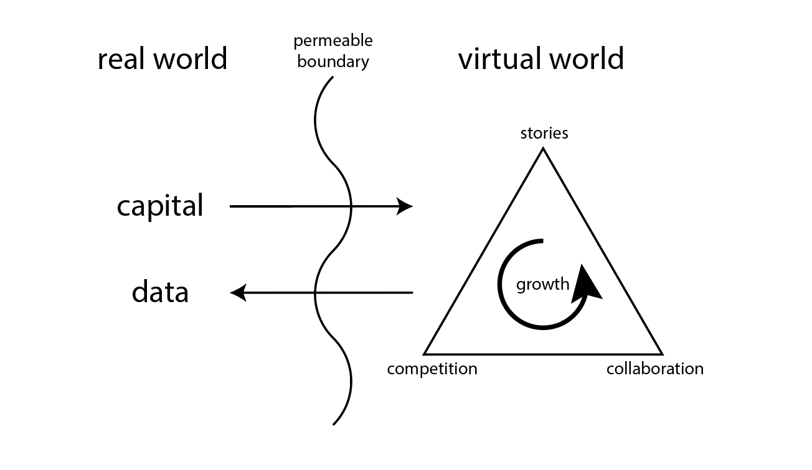

We propose a new perspective for building blockchain games based on world-centric game design. World-centric design emphasizes game mechanics that create a dynamic and interesting world rather than game mechanics that serve the player experience. For example, the table below illustrates world-centric versions of common place game mechanics.

|  player-centric mechanics |  world-centric mechanics             |
|---------------------------|--------------------------------------|
| replenishing resources    | finite resources                     |
| revival                   | permanent death                      |
| fast travel               | cartesian topology (no fast travel)  |
| NPC marketplaces          | player run marketplaces              |

Blockchain is an ideal environment for building world-centric games. Decentralization, self-sovreignty and code-as-law are foundational values to the platform. Thus, the blockchain game experience is ultimately driven by the emergent reality of its code rather than the intentions of its developers.

Furthermore, economies create real-world incentive to drive player decision making. Primary and secondary markets will fairly and entirely determine the value of any in game asset based solely on the collective valuation of the players. World-centric blockchain games thus translates to dynamic virtual economies that are exchangeable for and measurable in real world fiat.

In a traditional view, transactions in blockchain games are understood in-game actions. For the player, this interface is unfamiliar, expensive, and generally speaking a bad experience. Instead, we suggest understanding in-game actions as economic transactions of a rational player controlled agent. This interpretation seems promising if we consider the fact that blockchain games have yet to see mass adoption whereas decentralized exchanges are heavily used.

Finally, along side fiat-measurable assets, world-centric virtual worlds also safely generate valuable data as models for new markets with mechanism design limited only by the developer's imagination. In this regard, real world value flows into the game while innovative market driven narratives flow out. At worst, these are exciting stories for players to share; at best, these experiences might inform our real world economic policies.

A more precise example is better summarized in one picture:

At the start, external capital collateralizes the player's attention (perhaps through game sales, an ICO, airdrop, or plain marketing) and bootstraps the virtual world's economy.

With its initial state set, players compete and collaborate in the virtual world ultimately growing its economy and generating stories of value.

These virtual worlds can serve as playgrounds for new forms social organization. The stories provide valuable data on new economic mechanisms that might serve us in practice.

We summarize the goals of world-centric blockchain game design as follows:

1. To create self-sustaining economies where players compete and collaborate to grow an economically driven world narrative.
2. That these virtual worlds are dynamic, interesting and fun for players to explore.
3. To use these virtual worlds as models for radical markets with multiple agents incentivized by digital assets measurable in fiat currency.

# Repo
The documents in this repo is still a work in progress. For now, you can check the [Potato CBG design doc](https://github.com/pdlla/P2CBG_design/blob/master/potatocbg/README.md) which exemplifies this design perspective. There is also the [Potato Survival design doc](https://github.com/pdlla/P2CBG_design/blob/master/potato_survival.md). The rest of the documents in this repo are unfinished. They will be linked here once they are complete. At a high level, you can look forward to:

1. more documents elaborating this design perspective for both a blockchain and game theoretic perspective
2. detailed spec for Potato CBG MVP
3. EVM compatible code for Potato CBG MVP

You can also read more about world-centric game design [here](http://pdlla.org/posts/writing/2015-3_CBG.html).

# Future Applications
The design documents in this repository demonstrate how world-centric blockchain games might incorporate the Harberger tax and quadratic voting. We chose to highlight these mechanism as they are are both promising and straightforward to design. In this last section, we highlight just some other mechanisms that we think are  ready to integrate into a world-centric game.

- Outsourcing labor and risk: Since we expect there to be many world-centric blockchain games each with their own unique dynamic economy that might have very different values. Cross-game bridges can be built and governed between the two chains allowing each game to outsource labor and risk to the other one. This abstract reduction of capitalism, ethics and law, might inform us about the present situation of our global economy.

- Futarchy: We believe games are the best place to effectively playtest prediction markets for governance (futarchy). This is especially good for safety as futarchy has no obvious implementation and is understood under hypothetical conditions (moreover, the EMH assures an accurate measure of probability and not well-being).

# Existing Work
Whereas the explicit viewpoint of blockchain as a playground for world-centric game design to generate data on new economic mechanism is new, the practice of such is in fact not. Interleaving each new chain and ICO token is a complex dynamic emergent web of new relations that play out like a game. Each chain or exchange is a portal into this world. Each whitepaper is like a character sheet outlining what role the organization will play. Each enthusiast, developer, trader or investor is an independent agent trying to collaborate, and compete in the space.

This is why we feel confident that this is presently the best angle for games to grow constructively into the space of blockchain. If blockchain is indeed the paradigm shifting technology it purports to be, its applications themselves must be incommensurable with the existing understanding.
